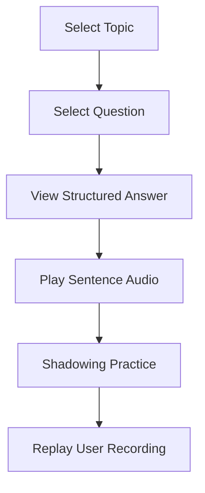
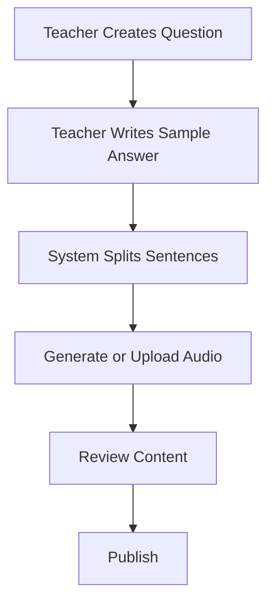
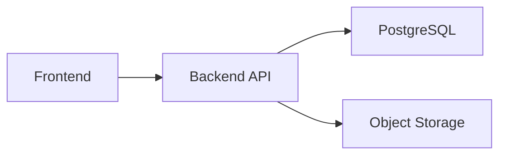

# Speaking Engine — PRD V1 (Current Scope)

# 1. Product Overview

## Product Name

Speaking Engine

## Module Name

Speaking Practice

## Product Positioning

A structured speaking practice system focused on:

```text
Question
→ Structured Sample Answer
→ Sentence-level Chunk
→ Audio Shadowing
→ Repeated Speaking Practice
```

The current version focuses ONLY on:

* IELTS speaking practice
* teacher-generated speaking content
* sentence-level chunking
* audio shadowing
* structured answer understanding

This version does NOT include:

* AI answer generation
* semantic chunking
* intent pattern engine
* transfer graph
* vector retrieval
* pronunciation scoring

The goal of V1 is:

# Build a structured speaking content foundation.

---

# 2. Product Goals

## User Goals

Help users:

* practice speaking daily
* imitate natural speaking rhythm
* understand answer structure
* improve fluency through repetition

---

## Business Goals

Build:

* structured speaking corpus
* reusable speaking assets
* sentence-level audio library
* scalable speaking content system

---

# 3. Current Product Scope

## Included Features

### 1. Topic-based Practice

Topics are lightweight content categories.

Current examples:

* Hometown
* School
* Work
* Technology
* Friends

---

### 2. Question Display

Example:

```text
Please describe your hometown.
```

Question metadata:

* topic
* category
* type
* framework

---

### 3. Teacher Sample Answer

Example:

```text
I come from Wuhan, which is a big city in central China.

There are many tourist attractions there.

Particularly East Lake, it is quiet and serene.
```

---

### 4. Sentence-level Chunking

IMPORTANT:

Current chunking is ONLY:

# sentence-based chunking

NOT:

* semantic chunking
* phrase chunking
* transferable chunking

Example:

| Chunk Order | Chunk Text                                              |
| ----------- | ------------------------------------------------------- |
| 1           | I come from Wuhan, which is a big city in central China |
| 2           | There are many tourist attractions there                |
| 3           | Particularly East Lake, it is quiet and serene          |

---

### 5. Audio Playback

Each sentence chunk supports:

* play
* replay
* slow playback

---

### 6. Shadowing Practice

User Flow:

```text
Play Audio
→ User Repeats
→ Record Voice
→ Replay Recording
```

---

### 7. Structure Labels

Current labels:

| Label     | Example                    |
| --------- | -------------------------- |
| Type      | Description                |
| Framework | Fact → Example → Highlight |

---

# 4. Out of Scope

The following are NOT included in V1:

* semantic chunk system
* intent pattern recognition
* chunk transfer graph
* AI-generated answers
* AI speaking feedback
* grammar correction
* pronunciation scoring
* personalized retrieval
* graph database
* vector database

---

# 5. User Flow



---

# 6. Core Data Model

## Topic

Topics are lightweight organizers.

```json
{
  "id": "topic_hometown",
  "code": "hometown",
  "category": "ielts",
  "name": "Hometown"
}
```

---

## Question

```json
{
  "id": "question_1",
  "topic_code": "hometown",
  "question": "Please describe your hometown.",
  "type": "Description",
  "framework": "Fact → Example → Highlight"
}
```

---

## Answer

```json
{
  "id": "answer_1",
  "question_id": "question_1"
}
```

---

## Sentence Chunk

IMPORTANT:

Chunk = sentence block.

```json
{
  "id": "chunk_1",
  "answer_id": "answer_1",
  "order": 1,
  "text": "I come from Wuhan, which is a big city in central China.",
  "audio_url": "https://cdn.xxx/audio/chunk_1.mp3"
}
```

---

# 7. Why Sentence-level Chunking

## Reason 1 — Easier Audio Management

```text
1 sentence
=
1 audio file
```

Benefits:

* easier storage
* easier playback
* easier CDN caching
* easier audio generation

---

## Reason 2 — Better Shadowing Experience

Users naturally practice:

# sentence by sentence

instead of semantic units.

---

## Reason 3 — Lower Content Production Cost

Teachers only need:

```text
Question
+
Sample Answer
+
Sentence Audio
```

No semantic annotation required.

---

## Reason 4 — Easier Future Upgrade

Future migration path:

```text
Sentence Chunk
→ Semantic Chunk
→ Transfer Chunk
```

---

# 8. Content Production Workflow



---

# 9. Audio Strategy

## Current Recommendation

Use high-quality TTS.

Recommended:

* OpenAI Voice
* ElevenLabs
* Azure TTS

---

## Audio Granularity

IMPORTANT:

```text
1 sentence
=
1 audio asset
```

Example:

| Sentence                           | Audio       |
| ---------------------------------- | ----------- |
| I come from Wuhan                  | audio_1.mp3 |
| There are many tourist attractions | audio_2.mp3 |
| Particularly East Lake...          | audio_3.mp3 |

---

# 10. Technical Architecture

## Backend Stack

Use:

* Golang
* REST API
* MySQL

Recommended architecture:

```text
handler
→ service
→ repository
→ storage
```

Recommended Golang libraries:

| Purpose        | Recommendation |
| -------------- | -------------- |
| HTTP Framework | Gin            |
| ORM            | GORM           |
| Config         | Viper          |
| Logging        | Zap            |
| Object Storage | OSS SDK        |

---

## Frontend Stack

Use:

* React
* TypeScript
* TailwindCSS

Frontend design goals:

* clean
* beautiful
* organized
* easy to use
* componentized
* responsive

The UI should prioritize:

# speaking practice efficiency

over visual complexity.

---

## Frontend UI Reference

Recommended UI reference:

```text
animal-island-ui
```

Reference repository:

https://github.com/guokaigdg/animal-island-ui/tree/main

Recommended frontend concepts to reference:

| UI Direction             | Usage                        |
| ------------------------ | ---------------------------- |
| Clean Card Layout        | Question & Chunk display     |
| Soft Color System        | Reduce cognitive load        |
| Rounded Components       | Mobile-friendly interaction  |
| Modular Component Design | Reusable speaking components |
| Clear Visual Hierarchy   | Improve speaking flow        |
| Consistent Spacing       | Better readability           |
| Lightweight Animation    | Audio interaction feedback   |

Recommended reusable frontend components:

| Component      | Purpose                |
| -------------- | ---------------------- |
| TopicCard      | Topic selection        |
| QuestionCard   | Question display       |
| ChunkCard      | Sentence chunk display |
| AudioPlayer    | Audio playback         |
| RecordButton   | Recording interaction  |
| ShadowingPanel | Speaking workflow      |
| FrameworkTag   | Framework label        |
| TypeTag        | Question type label    |

---



---

## Database

Use:

# MySQL

Current entities:

* topics
* questions
* answers
* chunks
* audio_assets

---

## File Storage

The storage layer should be abstracted.

Current implementation:

# OSS-compatible storage

Recommended first implementation:

* Alibaba Cloud OSS

Future-compatible providers:

* AWS S3
* Cloudflare R2
* MinIO

The backend should use a unified storage interface:

```text
StorageProvider
 ├── OSSProvider
 ├── S3Provider
 ├── R2Provider
```

This allows future migration without changing business logic.

Store:

* audio files

---

# 11. UI & Design Requirements

## Design Principles

The UI should focus on:

* simplicity
* fast practice flow
* low cognitive load
* strong audio interaction
* mobile-first usability
* reusable component architecture

The visual style should feel:

* modern
* lightweight
* calm
* education-focused
* highly usable
* visually clean

Recommended design direction:

* rounded cards
* clean typography
* soft spacing
* minimal colors
* strong visual hierarchy
* component-based layout

---

## Componentization Requirements

The frontend should use reusable UI components.

Recommended reusable components:

| Component      | Purpose                |
| -------------- | ---------------------- |
| TopicCard      | Topic selection        |
| QuestionCard   | Display question       |
| ChunkCard      | Sentence chunk display |
| AudioPlayer    | Audio controls         |
| RecordButton   | Recording interaction  |
| ShadowingPanel | Shadowing workflow     |
| FrameworkTag   | Framework label        |
| TypeTag        | Question type label    |

---

## UX Requirements

### 1. One-click Playback

Users should be able to:

* play audio quickly
* replay instantly
* switch slow mode easily

---

### 2. Clear Chunk Separation

Each sentence chunk should:

* be visually separated
* support independent playback
* support independent recording

---

### 3. Mobile-first Interaction

The UI should work well on:

* mobile devices
* tablets
* desktop

Priority:

# mobile speaking practice experience

---

## UI Modules

## 1. Topic List

Displays:

* topic name
* category

---

## 2. Question Panel

Displays:

* question
* type label
* framework label

---

## 3. Structured Answer Area

Displays:

* sentence chunks
* play button
* replay button
* shadowing button

---

## 4. Audio Player

Supports:

* play
* replay
* slow mode

---

## 5. Recording Panel

Supports:

* start recording
* replay recording

---

# 12. Future Evolution

## V2

Add:

* semantic chunks
* chunk tagging
* reusable expression library

---

## V3

Add:

* intent patterns
* transfer graph
* AI retrieval

---

## V4

Add:

* AI feedback
* pronunciation scoring
* free speaking generation

---

# 13. Success Metrics

## Learning Metrics

* daily shadowing count
* replay count
* practice duration
* repeat practice rate

---

## Content Metrics

* questions created
* answers created
* audio assets accumulated
* sentence chunks accumulated

---

## Product Metrics

* DAU
* retention
* completion rate
* shadowing usage rate

---

# 14. Core Product Philosophy

The system is NOT:

```text
Question → Memorization
```

The system IS:

```text
Question
→ Structured Speaking Input
→ Sentence-level Practice
→ Repeatable Speaking Training
→ Reusable Speaking Assets
```

The first priority is:

# Build structured speaking assets before AI generation.
